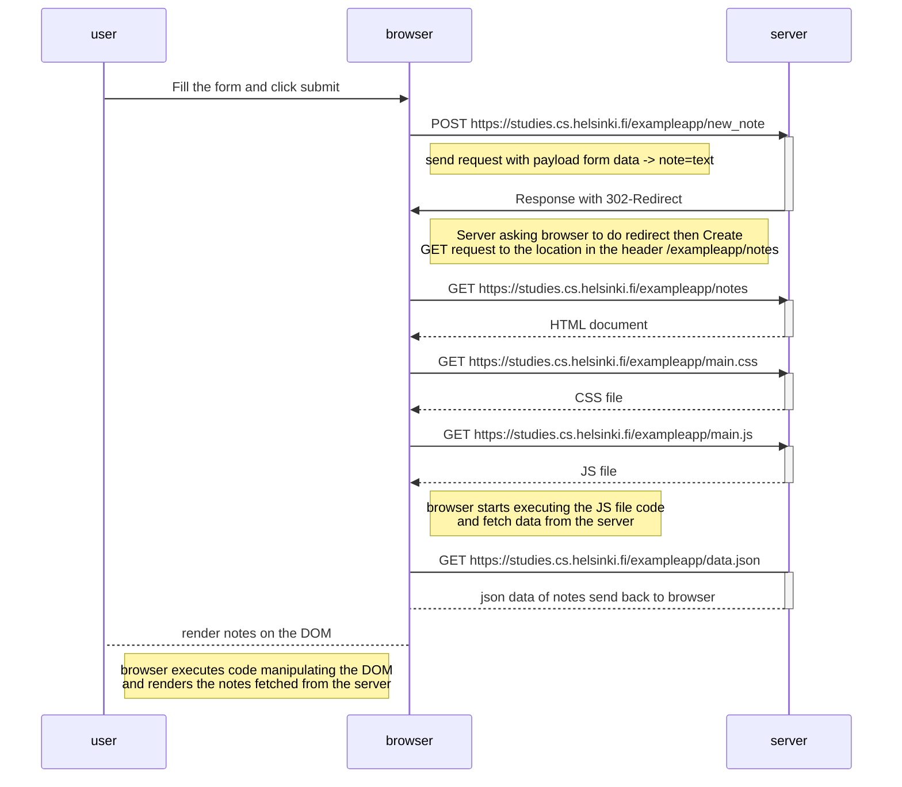

```mermaid
sequenceDiagram
    participant user
    participant browser
    participant server

    user->>browser: Fill the form and click submit

    browser->>server: POST https://studies.cs.helsinki.fi/exampleapp/new_note
    activate server

    note right of browser: send request with payload form data -> note=text


    server->>browser: Response with 302-Redirect
    deactivate server
    note left of server: Server asking browser to do redirect then Create <br/> GET request to the location in the header /exampleapp/notes


    browser->>server: GET https://studies.cs.helsinki.fi/exampleapp/notes
    activate server
    server-->>browser: HTML document
    deactivate server

    browser->>server: GET https://studies.cs.helsinki.fi/exampleapp/main.css
    activate server
    server-->>browser: CSS file
    deactivate server

    browser->>server: GET https://studies.cs.helsinki.fi/exampleapp/main.js
    activate server
    server-->>browser: JS file
    deactivate server
    note right of browser: browser starts executing the JS file code <br/> and fetch data from the server

    browser->server: GET https://studies.cs.helsinki.fi/exampleapp/data.json
    activate server
    server-->browser: json data of notes send back to browser
    deactivate server
    browser-->user: render notes on the DOM
    note left of browser: browser executes code  manipulating the DOM <br/> and renders the notes fetched from the server


```
