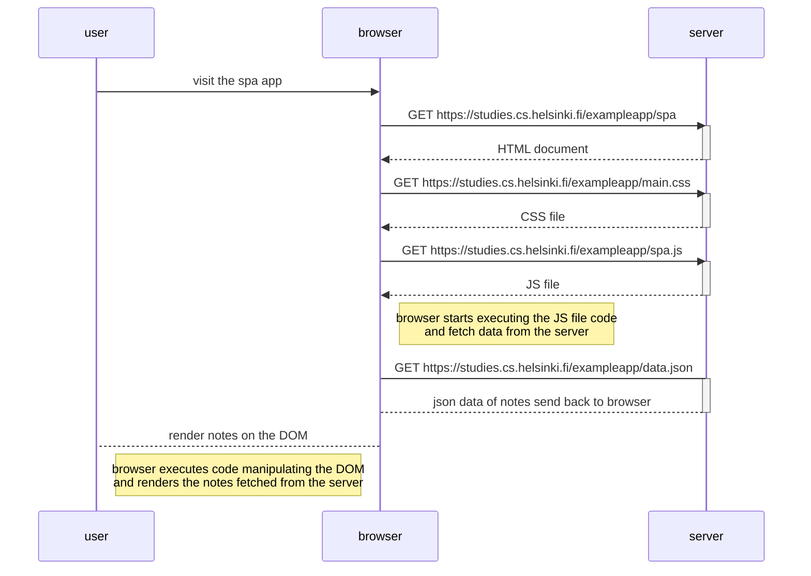

```mermaid
sequenceDiagram
    participant user
    participant browser
    participant server

    user->>browser: visit the spa app


    browser->>server: GET https://studies.cs.helsinki.fi/exampleapp/spa
    activate server
    server-->>browser: HTML document
    deactivate server

    browser->>server: GET https://studies.cs.helsinki.fi/exampleapp/main.css
    activate server
    server-->>browser: CSS file
    deactivate server

    browser->>server: GET https://studies.cs.helsinki.fi/exampleapp/spa.js
    activate server
    server-->>browser: JS file
    deactivate server
    note right of browser: browser starts executing the JS file code <br/> and fetch data from the server

    browser->server: GET https://studies.cs.helsinki.fi/exampleapp/data.json
    activate server
    server-->browser: json data of notes send back to browser
    deactivate server
    browser-->user: render notes on the DOM
    note left of browser: browser executes code  manipulating the DOM <br/> and renders the notes fetched from the server


```
