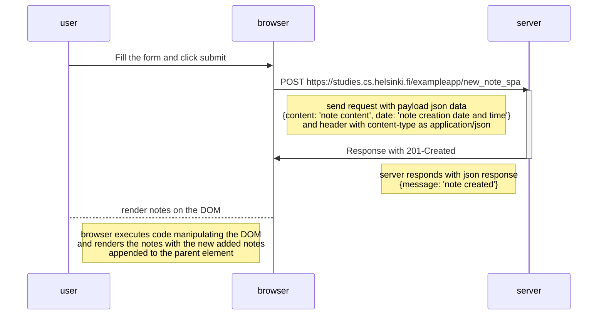

```mermaid
sequenceDiagram
    participant user
    participant browser
    participant server

    user->>browser: Fill the form and click submit

    browser->>server: POST https://studies.cs.helsinki.fi/exampleapp/new_note_spa
    activate server

    note right of browser: send request with payload json data <br/>   {content: 'note content', date: 'note creation date and time'} <br/> and header with content-type as application/json


    server->>browser: Response with 201-Created
    deactivate server
    note left of server: server responds with json response <br/> {message: 'note created'}


    
    browser-->user: render notes on the DOM
    note left of browser: browser executes code  manipulating the DOM <br/> and renders the notes  with the new added notes <br/> appended to the parent element


```
